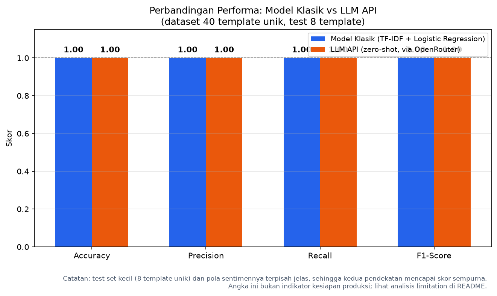

# AI Model Experiment & Evaluation

Eksperimen untuk membandingkan dua pendekatan dalam menyelesaikan **sentiment analysis ulasan produk e-commerce**:

1. **Model klasik**: TF-IDF + Logistic Regression menggunakan Scikit-learn (dilatih sendiri)
2. **LLM API**: prompt zero-shot melalui Gemini API, dengan fallback OpenRouter

Kedua pendekatan dievaluasi pada **test set yang sama** agar perbandingannya adil. Ini merupakan tugas individual sesi 9 **Rework Academy**.

---

## 1. Problem Statement

**Objective:** tim produk e-commerce ingin membangun fitur otomatis yang mengklasifikasikan sentimen ulasan pelanggan (positif/negatif) di halaman produk. Sebelum tim memutuskan pendekatan mana yang akan dipakai di sistem produksi, dilakukan eksperimen awal untuk membandingkan dua kandidat pendekatan: model klasik yang dilatih sendiri vs LLM API.

**Target/label:** kolom `sentiment` dengan dua kelas, `positif` dan `negatif`.

**Batasan & asumsi:**
- Hanya menggunakan dataset `customer_reviews_sentiment.csv` (200 baris) yang dibagikan, tidak mencari dataset lain.
- Ulasan berbahasa Indonesia dan pendek (43–71 karakter per ulasan).
- Label pada dataset dianggap benar.
- Test set yang sama digunakan untuk kedua pendekatan.
- Karena banyak baris yang merupakan pengulangan dari template review yang sama, split dilakukan per template unik agar tidak terjadi kebocoran data (dijelaskan lebih lanjut di bawah).

---

## 2. Dataset

| | |
|---|---|
| File | `data/customer_reviews_sentiment.csv` |
| Jumlah baris | 200 |
| Kolom | `review_id`, `product_name`, `review_text`, `sentiment` |
| Distribusi label | 110 positif (55%), 90 negatif (45%) |
| Missing values | tidak ada |

**Temuan penting:** dari 200 baris, hanya **40 template review unik**. Sisanya merupakan pengulangan dari template yang sama. Contohnya `"Produknya rapi dan bersih, tidak ada cacat sama sekali."` muncul 9 kali, `"Pelayanan ramah dan responsif..."` muncul 8 kali, dan seterusnya.

Jika data di-split secara langsung, template yang sama dapat muncul di train **dan** test sekaligus. Model klasik akan terlihat baik bukan karena memahami pola, tetapi karena menghafal. Oleh karena itu, split dilakukan **setelah menghapus duplikat `review_text`**, kemudian hasil split tersebut digunakan untuk kedua pendekatan. Ini membuat evaluasi lebih jujur.

**Hasil split (berbasis template unik):**

| Split | Jumlah |
|---|---|
| Template unik | 40 |
| Train | 32 |
| Test | 8 (4 positif, 4 negatif) |

Test set berukuran kecil. Ini merupakan konsekuensi dari dataset yang memang sintetis dan banyak pengulangan. Justru hal ini menjadi bahan analisis: hasil 100% di sini tidak berarti model siap digunakan di produksi.

---

## 3. Ringkasan Eksperimen

### Pendekatan 1: Model Klasik (Scikit-learn)

- Teks diubah menjadi angka menggunakan **TF-IDF** (131 fitur dari 32 dokumen train).
- Model: **Logistic Regression** (`max_iter=1000`).
- Prediksi dilakukan pada test set, kemudian dihitung metriknya.

**Mengapa Logistic Regression, bukan metode lain?** Pilihan ini sebenarnya sudah disediakan kerangkanya di starter notebook (import `LogisticRegression` dari Scikit-learn). Sebagai pertimbangan teknis, LR memang cocok untuk kasus ini:

- **Cocok untuk klasifikasi biner.** Dataset ini hanya memiliki dua kelas (positif/negatif), dan LR memang dirancang untuk memprediksi probabilitas kelas biner. Hasilnya mudah diinterpretasi.
- **Teks pendek + fitur TF-IDF.** Ulasan pada dataset ini pendek (43–71 karakter). Vektor TF-IDF-nya relatif kecil, sehingga model linear seperti LR sudah cukup; tidak perlu model kompleks (misalnya ensemble atau gradient boosting) yang lebih berat dan rawan overfit pada data kecil.
- **Cepat dilatih dan ringan.** Dataset train hanya 32 baris. LR selesai dilatih dalam hitungan detik, ukuran modelnya kecil, dan mudah di-deploy, sehingga cocok untuk dijadikan baseline sebelum mencoba metode yang lebih rumit.
- **Titik awal yang wajar.** Untuk eksperimen awal, LR merupakan pilihan default yang sehat: performanya baik, mudah dipahami, dan apabila kurang memuaskan dapat diganti dengan model lain (misalnya SVM, Random Forest, atau fine-tuning model bahasa).

Metode lain seperti **SVM/Random Forest** sebenarnya dapat digunakan, tetapi untuk dataset sekecil ini hasilnya biasanya tidak jauh berbeda, sementara lebih banyak waktu yang dibutuhkan untuk tuning. Jadi LR dipilih sebagai baseline yang paling masuk akal secara effort dan hasil.

### Pendekatan 2: LLM API

- Prompt **zero-shot**: model langsung diminta mengklasifikasikan tanpa contoh terlebih dahulu. Alasannya, kelasnya hanya dua dan teksnya pendek, sehingga zero-shot sudah cukup dan paling murah.
- Sistem prompt dibuat tegas: *"Jawab HANYA dengan satu kata: positif atau negatif."* agar output mudah dinormalisasi.
- `temperature = 0.2` (rendah, agar output konsisten. Tugas klasifikasi membutuhkan determinisme, bukan kreativitas).
- API key dibaca dari environment variable (`GEMINI_API_KEY`), tidak di-hardcode. Notebook ini bersifat dual-provider: jika `GEMINI_API_KEY` tersedia dan region mendukung, digunakan Gemini langsung; jika tidak, fallback ke OpenRouter (`deepseek/deepseek-v4.1-flash`).
- Catatan versi model: `gemini-2.0-flash` yang ada di starter notebook sudah tidak tersedia di API Gemini, sehingga disesuaikan.

---

## 4. Hasil Evaluasi

Kedua pendekatan menghasilkan skor yang sama pada test set:

| Metrik | Model Klasik | LLM API |
|---|---|---|
| Accuracy | **1.0000** | **1.0000** |
| Precision (positif) | 1.0000 | 1.0000 |
| Recall (positif) | 1.0000 | 1.0000 |
| F1-Score (positif) | 1.0000 | 1.0000 |

**Confusion matrix** (baris = label asli, kolom = prediksi; urutan positif-negatif):

| | Prediksi positif | Prediksi negatif |
|---|---|---|
| **Asli positif** | 4 | 0 |
| **Asli negatif** | 0 | 4 |

Kedua pendekatan sama-sama berhasil memprediksi 4 ulasan positif dan 4 ulasan negatif dengan benar, tanpa kesalahan.



---

## 5. Analisis Trade-off dan Limitation

### Performa

Kedua pendekatan memperoleh skor 1.0. Namun hal ini **bukan** indikator yang menggembirakan. Ini menunjukkan bahwa dataset terlalu mudah:

- Test set hanya 8 template, dan polanya sangat jelas. Kata-kata seperti "puas", "lambat", "kecewa" langsung menunjukkan sentimennya.
- Model klasik mampu menghafal pola kata, sedangkan LLM mampu membaca makna. Keduanya tidak benar-benar diuji pada dataset ini.

Kesimpulan yang jujur: **pada dataset ini kedua pendekatan setara, tetapi datanya belum cukup menantang untuk membedakan kualitas keduanya.**

### Trade-off effort, kecepatan, biaya

| Aspek | Model Klasik | LLM API |
|---|---|---|
| Training | Perlu fit dan mungkin tuning | Tidak perlu training |
| Kecepatan inference | Milidetik, dapat offline | Sekitar 1–5 detik per review, butuh koneksi API |
| Biaya | Hampir nol (CPU biasa) | Per token; pada skala besar cukup signifikan |
| Maintenance | Perlu retrain jika data berubah | Cukup update prompt |
| Kemampuan bahasa | Terbatas pada kosakata di data train | Paham konteks, bahasa gaul, sinonim |

### Keterbatasan yang diamati

**LLM API:**
- Output **kadang kosong atau tidak valid**. Dari 8 panggilan pada notebook ada yang membutuhkan normalisasi/retry. Ini membuat pipeline perlu memiliki lapisan pembersih output.
- Tidak 100% deterministik: suhu 0.2 mengurangi variasi, tetapi tidak menghilangkannya.
- Ada biaya per panggilan dan ketergantungan ke pihak ketiga (rate limit, region, ketersediaan model).

**Model klasik:**
- Membutuhkan data berlabel yang cukup untuk dilatih; dengan 32 data train saja sudah sangat menempel.
- Kurang peka terhadap konteks/sinonim: kalimat seperti *"harganya murah tapi ternyata menipu"* dapat salah dibaca jika kata "murah" diasosiasikan dengan sentimen positif.
- Jika pola ulasan berubah (bahasa baru, produk baru), model harus dilatih ulang.

---

## 6. Rekomendasi Technical Approach

**Untuk tahap ini, rekomendasi adalah memulai dari model klasik (TF-IDF + Logistic Regression) sebagai baseline produksi.**

Alasannya:

- Performanya setara dengan LLM pada dataset ini, tetapi **jauh lebih murah, cepat, dan deterministik**.
- Mudah di-deploy (file kecil, tanpa ketergantungan API), cocok untuk tim kecil yang baru memulai.
- Dapat langsung dipasang sebagai model pertama, lalu diukur pada data produksi yang sebenarnya.

**Namun**, jika ulasan ke depannya semakin beragam (slang, typo, sarkasme, bahasa campuran), LLM API lebih unggul karena tidak perlu dilatih ulang dan lebih memahami konteks. Strategi yang sering digunakan tim produk: **hybrid** — model klasik untuk volume besar yang polanya jelas, LLM untuk kasus yang membuat model klasik ragu (confidence rendah).

Keputusan final tetap bergantung pada budget dan kebutuhan latensi tim.

---

## 7. Cara Menjalankan

### 1. Clone & install

```bash
git clone https://github.com/NafisHandoko/assignment-model-experiment-nafis-handoko.git
cd assignment-model-experiment-nafis-handoko

python -m venv venv
source venv/bin/activate        # Linux/Mac
# venv\Scripts\activate         # Windows

pip install -r requirements.txt
```

`requirements.txt` berisi: `pandas`, `scikit-learn`, `jupyter`, `nbconvert`, `ipykernel`, `google-genai` (untuk jalur Gemini).

### 2. Set API key (opsional, hanya untuk LLM)

Buat file `.env` di **root repo** (jangan di-commit — sudah di-exclude oleh `.gitignore`):

```bash
# .env  (letakkan di root, sejajar dengan README.md)
GEMINI_API_KEY=***
OPENROUTER_API_KEY=***
```

Notebook membaca file ini otomatis via `python-dotenv` (`load_dotenv()` di cell setup). Cukup isi salah satu:

- `GEMINI_API_KEY` — untuk memakai Gemini langsung (jalur utama).
- `OPENROUTER_API_KEY` — untuk fallback ke OpenRouter (`deepseek/deepseek-v4-flash-0731`).

Jika keduanya tidak di-set, bagian LLM akan gagal (ada pesan error yang jelas). Bagian model klasik tetap berjalan tanpa API key.

### 3. Jalankan notebook

```bash
jupyter notebook notebook/experiment_notebook.ipynb
```

Atau langsung dari terminal:

```bash
jupyter nbconvert --to notebook --execute --inplace notebook/experiment_notebook.ipynb
```

---

## 8. Struktur Folder

```
assignment-model-experiment-nafis-handoko/
├── data/
│   └── customer_reviews_sentiment.csv
├── notebook/
│   └── experiment_notebook.ipynb
├── documentation/
│   └── model_comparison_summary.png
├── README.md
└── requirements.txt
```